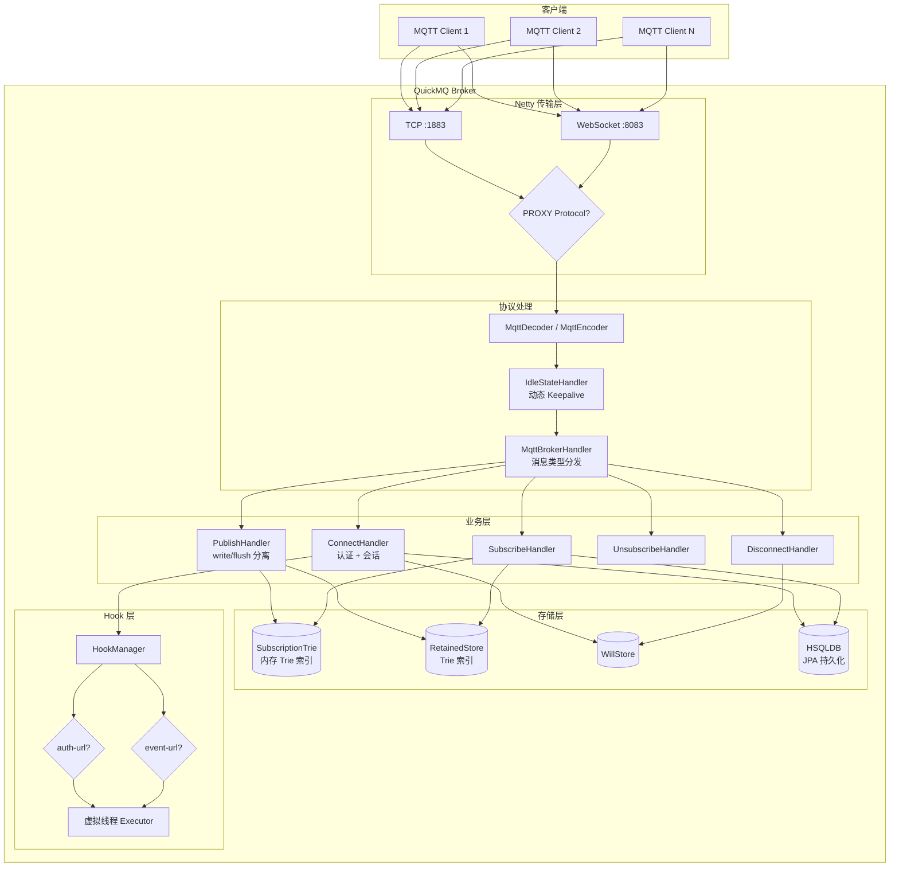
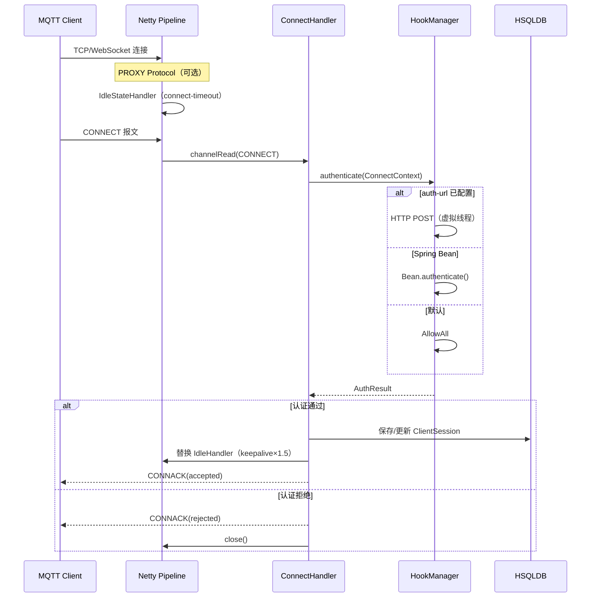
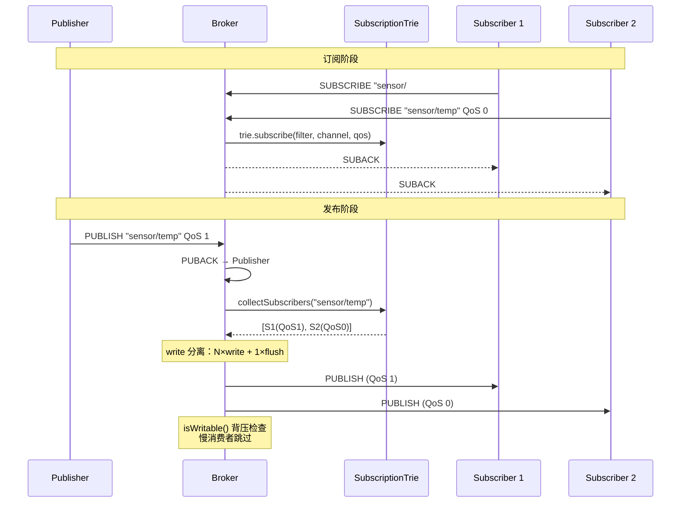

# QuickMQ

基于 **Spring Boot 3 + Netty + JPA** 的高性能 MQTT Broker，面向单机百万长连接场景设计。**完整的 MQTT 3.1.1 协议实现**，支持所有必需特性与扩展功能。

---

## 特性

- **完整的 MQTT 3.1.1 协议**：全协议支持包括 CONNECT/CONNACK、PUBLISH/PUBACK/PUBREC/PUBREL/PUBCOMP、SUBSCRIBE/SUBACK、UNSUBSCRIBE/UNSUBACK、PINGREQ/PINGRESP、DISCONNECT
- **完整的 QoS 支持**：QoS 0（最多一次）、QoS 1（至少一次）、QoS 2（恰好一次）消息传递保证
- **TLS/SSL 加密**：支持 MQTT over TLS/SSL 和 WebSocket Secure (WSS)
- **ACL 权限控制**：基于主题的发布/订阅权限控制，支持白名单/黑名单规则
- **会话管理**：Clean Session 标志、会话持久化、会话过期机制
- **完整的 CONNACK 错误码**：支持所有 MQTT 3.1.1 规范定义的连接拒绝原因
- **主题验证**：严格的 MQTT 主题名和通配符验证
- **保留消息**：支持保留消息持久化存储
- **遗嘱消息**：客户端异常断开时发布预设的遗嘱消息
- **多端口**：TCP 与 WebSocket 可同时监听多个端口
- **动态 Keepalive**：客户端 keepalive × 1.5 做空闲检测，支持服务端默认值与上限
- **HAProxy PROXY Protocol**：可选开启，透传真实客户端 IP
- **认证与审计 Hook**：HTTP Webhook（虚拟线程）或 Spring Bean，留空放行所有
- **数据持久化**：HSQLDB + JPA + QueryDSL，会话/订阅/保留消息/QoS 2 消息状态重启不丢
- **百万连接优化**：Epoll、4KB Socket 缓冲、Recycler 对象池、Trie 订阅索引、write/flush 分离与背压
- **容器化部署**：Dockerfile 多阶段构建、docker-compose 一键启动

---

## 技术栈

| 组件 | 说明 |
|------|------|
| JDK 21 | 虚拟线程用于 Hook HTTP 调用与 JPA 阻塞 IO |
| Spring Boot 3.2 | 无 Web 容器，纯后端服务 |
| Netty 4.x | TCP + WebSocket，Linux 自动 Epoll，SSL/TLS 支持 |
| HSQLDB | 嵌入式数据库，纯内存模式推荐 |
| JPA + QueryDSL | 会话 / 订阅 / 保留消息 / QoS 2 状态持久化 |

---

## 安全与合规特性

### TLS/SSL 加密传输
- **MQTT over TLS**：支持 SSL/TLS 加密的 MQTT 连接
- **WebSocket Secure**：支持 WSS (WebSocket Secure) 连接
- **证书管理**：支持 PEM 格式证书和私钥
- **双向 TLS**：可选客户端证书验证（mTLS）

### ACL 访问控制
- **主题级权限**：基于 MQTT 主题的发布/订阅权限控制
- **规则引擎**：支持白名单和黑名单规则
- **集成 Hook**：可通过 HTTP Webhook 或 Spring Bean 实现动态 ACL
- **默认策略**：未配置 ACL 时允许所有操作

### 认证与授权
- **多重认证方式**：HTTP Webhook、Spring Bean、默认放行
- **灵活集成**：可对接现有用户系统（LDAP、OAuth、数据库等）
- **审计日志**：完整的事件 Hook 系统，记录所有关键操作

### 协议合规性
- **完整的 MQTT 3.1.1**：支持所有必需和可选特性
- **严格的协议验证**：报文格式、协议版本、标志位验证
- **正确的错误处理**：完整的 CONNACK 错误码和原因码
- **主题规范**：严格的 MQTT 主题名和通配符验证

---

## 整体架构

![整体架构](https://mermaid.ink/svg/Z3JhcGggVEIKICAgIHN1YmdyYXBoIOWuouaIt%2BerrwogICAgICAgIEMxW01RVFQgQ2xpZW50IDFdCiAgICAgICAgQzJbTVFUVCBDbGllbnQgMl0KICAgICAgICBDTltNUVRUIENsaWVudCBOXQogICAgZW5kCgogICAgc3ViZ3JhcGggUXVpY2tNUSBCcm9rZXIKICAgICAgICBzdWJncmFwaCBOZXR0eSDkvKDovpPlsYIKICAgICAgICAgICAgVENQW1RDUCA6MTg4M10KICAgICAgICAgICAgV1NbV2ViU29ja2V0IDo4MDgzXQogICAgICAgICAgICBQUHtQUk9YWSBQcm90b2NvbD99CiAgICAgICAgZW5kCgogICAgICAgIHN1YmdyYXBoIOWNj%2BiuruWkhOeQhgogICAgICAgICAgICBERUNbTXF0dERlY29kZXIgLyBNcXR0RW5jb2Rlcl0KICAgICAgICAgICAgSURMRVtJZGxlU3RhdGVIYW5kbGVyPGJyLz7liqjmgIEgS2VlcGFsaXZlXQogICAgICAgICAgICBCSFtNcXR0QnJva2VySGFuZGxlcjxici8%2B5raI5oGv57G75Z6L5YiG5Y%2BRXQogICAgICAgIGVuZAoKICAgICAgICBzdWJncmFwaCDkuJrliqHlsYIKICAgICAgICAgICAgQ09OTltDb25uZWN0SGFuZGxlcjxici8%2B6K6k6K%2BBICsg5Lya6K%2BdXQogICAgICAgICAgICBQVUJbUHVibGlzaEhhbmRsZXI8YnIvPndyaXRlL2ZsdXNoIOWIhuemu10KICAgICAgICAgICAgU1VCW1N1YnNjcmliZUhhbmRsZXJdCiAgICAgICAgICAgIFVOU1VCW1Vuc3Vic2NyaWJlSGFuZGxlcl0KICAgICAgICAgICAgRElTQ1tEaXNjb25uZWN0SGFuZGxlcl0KICAgICAgICBlbmQKCiAgICAgICAgc3ViZ3JhcGgg5a2Y5YKo5bGCCiAgICAgICAgICAgIFRSSUVbKFN1YnNjcmlwdGlvblRyaWU8YnIvPuWGheWtmCBUcmllIOe0ouW8lSldCiAgICAgICAgICAgIFJFVFsoUmV0YWluZWRTdG9yZTxici8%2BVHJpZSDntKLlvJUpXQogICAgICAgICAgICBXSUxMWyhXaWxsU3RvcmUpXQogICAgICAgICAgICBEQlsoSFNRTERCPGJyLz5KUEEg5oyB5LmF5YyWKV0KICAgICAgICBlbmQKCiAgICAgICAgc3ViZ3JhcGggSG9vayDlsYIKICAgICAgICAgICAgSE1bSG9va01hbmFnZXJdCiAgICAgICAgICAgIEFVVEh7YXV0aC11cmw%2FfQogICAgICAgICAgICBFVlR7ZXZlbnQtdXJsP30KICAgICAgICAgICAgVlRb6Jma5ouf57q%2F56iLIEV4ZWN1dG9yXQogICAgICAgIGVuZAogICAgZW5kCgogICAgQzEgJiBDMiAmIENOIC0tPiBUQ1AgJiBXUwogICAgVENQICYgV1MgLS0%2BIFBQIC0tPiBERUMgLS0%2BIElETEUgLS0%2BIEJICiAgICBCSCAtLT4gQ09OTiAmIFBVQiAmIFNVQiAmIFVOU1VCICYgRElTQwogICAgQ09OTiAtLT4gSE0gLS0%2BIEFVVEggLS0%2BIFZUCiAgICBQVUIgLS0%2BIFRSSUUgJiBSRVQKICAgIFNVQiAtLT4gVFJJRSAmIFJFVAogICAgQ09OTiAmIERJU0MgLS0%2BIFdJTEwKICAgIENPTk4gJiBTVUIgLS0%2BIERCCiAgICBITSAtLT4gRVZUIC0tPiBWVAo%3D)

> **生成图片**：运行 `./generate-diagrams.sh` 生成 SVG/PNG 图片。如果图片未生成，可使用下面的 Mermaid 代码在线渲染。

<details>
<summary>点击查看 Mermaid 源代码</summary>


</details>

---

## 连接与认证流程

![连接与认证流程](https://mermaid.ink/svg/c2VxdWVuY2VEaWFncmFtCiAgICBwYXJ0aWNpcGFudCBDIGFzIE1RVFQgQ2xpZW50CiAgICBwYXJ0aWNpcGFudCBOIGFzIE5ldHR5IFBpcGVsaW5lCiAgICBwYXJ0aWNpcGFudCBIIGFzIENvbm5lY3RIYW5kbGVyCiAgICBwYXJ0aWNpcGFudCBITSBhcyBIb29rTWFuYWdlcgogICAgcGFydGljaXBhbnQgREIgYXMgSFNRTERCCgogICAgQy0%2BPk46IFRDUC9XZWJTb2NrZXQg6L%2Be5o6lCiAgICBOb3RlIG92ZXIgTjogUFJPWFkgUHJvdG9jb2zvvIjlj6%2FpgInvvIkKICAgIE4tPj5OOiBJZGxlU3RhdGVIYW5kbGVy77yIY29ubmVjdC10aW1lb3V077yJCiAgICBDLT4%2BTjogQ09OTkVDVCDmiqXmlocKICAgIE4tPj5IOiBjaGFubmVsUmVhZChDT05ORUNUKQogICAgSC0%2BPkhNOiBhdXRoZW50aWNhdGUoQ29ubmVjdENvbnRleHQpCiAgICBhbHQgYXV0aC11cmwg5bey6YWN572uCiAgICAgICAgSE0tPj5ITTogSFRUUCBQT1NU77yI6Jma5ouf57q%2F56iL77yJCiAgICBlbHNlIFNwcmluZyBCZWFuCiAgICAgICAgSE0tPj5ITTogQmVhbi5hdXRoZW50aWNhdGUoKQogICAgZWxzZSDpu5jorqQKICAgICAgICBITS0%2BPkhNOiBBbGxvd0FsbAogICAgZW5kCiAgICBITS0tPj5IOiBBdXRoUmVzdWx0CiAgICBhbHQg6K6k6K%2BB6YCa6L%2BHCiAgICAgICAgSC0%2BPkRCOiDkv53lrZgv5pu05pawIENsaWVudFNlc3Npb24KICAgICAgICBILT4%2BTjog5pu%2F5o2iIElkbGVIYW5kbGVy77yIa2VlcGFsaXZlw5cxLjXvvIkKICAgICAgICBILS0%2BPkM6IENPTk5BQ0soYWNjZXB0ZWQpCiAgICBlbHNlIOiupOivgeaLkue7nQogICAgICAgIEgtLT4%2BQzogQ09OTkFDSyhyZWplY3RlZCkKICAgICAgICBILT4%2BTjogY2xvc2UoKQogICAgZW5kCg%3D%3D)

> **生成图片**：运行 `./generate-diagrams.sh` 生成 SVG/PNG 图片。如果图片未生成，可使用下面的 Mermaid 代码在线渲染。

<details>
<summary>点击查看 Mermaid 源代码</summary>


</details>

---

## 发布与订阅流程

![发布与订阅流程](https://mermaid.ink/svg/c2VxdWVuY2VEaWFncmFtCiAgICBwYXJ0aWNpcGFudCBQIGFzIFB1Ymxpc2hlcgogICAgcGFydGljaXBhbnQgQiBhcyBCcm9rZXIKICAgIHBhcnRpY2lwYW50IFQgYXMgU3Vic2NyaXB0aW9uVHJpZQogICAgcGFydGljaXBhbnQgUzEgYXMgU3Vic2NyaWJlciAxCiAgICBwYXJ0aWNpcGFudCBTMiBhcyBTdWJzY3JpYmVyIDIKCiAgICBOb3RlIG92ZXIgUCxTMjog6K6i6ZiF6Zi25q61CiAgICBTMS0%2BPkI6IFNVQlNDUklCRSAic2Vuc29yLyMiIFFvUyAxCiAgICBTMi0%2BPkI6IFNVQlNDUklCRSAic2Vuc29yL3RlbXAiIFFvUyAwCiAgICBCLT4%2BVDogdHJpZS5zdWJzY3JpYmUoZmlsdGVyLCBjaGFubmVsLCBxb3MpCiAgICBCLS0%2BPlMxOiBTVUJBQ0sKICAgIEItLT4%2BUzI6IFNVQkFDSwoKICAgIE5vdGUgb3ZlciBQLFMyOiDlj5HluIPpmLbmrrUKICAgIFAtPj5COiBQVUJMSVNIICJzZW5zb3IvdGVtcCIgUW9TIDEKICAgIEItPj5COiBQVUJBQ0sg4oaSIFB1Ymxpc2hlcgogICAgQi0%2BPlQ6IGNvbGxlY3RTdWJzY3JpYmVycygic2Vuc29yL3RlbXAiKQogICAgVC0tPj5COiBbUzEoUW9TMSksIFMyKFFvUzApXQogICAgTm90ZSBvdmVyIEI6IHdyaXRlIOWIhuemu%2B%2B8mk7Dl3dyaXRlICsgMcOXZmx1c2gKICAgIEItPj5TMTogUFVCTElTSCAoUW9TIDEpCiAgICBCLT4%2BUzI6IFBVQkxJU0ggKFFvUyAwKQogICAgTm90ZSBvdmVyIEI6IGlzV3JpdGFibGUoKSDog4zljovmo4Dmn6U8YnIvPuaFoua2iOi0ueiAhei3s%2Bi%2Fhwo%3D)

> **生成图片**：运行 `./generate-diagrams.sh` 生成 SVG/PNG 图片。如果图片未生成，可使用下面的 Mermaid 代码在线渲染。

<details>
<summary>点击查看 Mermaid 源代码</summary>


</details>

---

## Hook 系统

```mermaid
graph LR
    subgraph 认证 Hook（必选）
        A1[auth-url HTTP] -->|优先| R[AuthResult]
        A2[Spring Bean] -->|次选| R
        A3[DefaultAuthHook<br/>放行所有] -->|兜底| R
    end

    subgraph 事件 Hook（可选）
        E1[event-url HTTP]
        E2[Spring Bean]
        E1 & E2 -->|合并| F[fire-and-forget]
    end

    subgraph 执行方式
        F --> VT[虚拟线程<br/>不阻塞 EventLoop]
    end
```

**认证请求/响应示例**：

```json
// 请求
{"clientId":"c1","username":"admin","password":"base64...","remoteAddress":"1.2.3.4","remotePort":54321,"protocolVersion":4,"cleanSession":true}
// 响应（放行）
{"result":"allow"}
// 响应（拒绝）
{"result":"deny","reason":"bad credentials"}
```

**事件上报示例**（8 类 `action`）：

```json
{"action":"client_connected","clientId":"c1","remoteAddress":"1.2.3.4","remotePort":54321,"timestamp":1741484400000}
{"action":"client_disconnected","clientId":"c1","remoteAddress":"1.2.3.4","remotePort":54321,"reason":"NORMAL","timestamp":1741484400000}
{"action":"message_publish","clientId":"c1","topic":"sensor/temp","qos":1,"retain":false,"payloadSize":128,"timestamp":1741484400000}
{"action":"message_delivered","clientId":"c1","topic":"sensor/temp","subscriberCount":3,"timestamp":1741484400000}
{"action":"client_subscribe","clientId":"c1","topicFilters":["sensor/#","cmd/+"],"timestamp":1741484400000}
{"action":"client_unsubscribe","clientId":"c1","topicFilters":["sensor/#"],"timestamp":1741484400000}
{"action":"connect_rejected","clientId":"c1","remoteAddress":"1.2.3.4","remotePort":54321,"reason":"bad credentials","timestamp":1741484400000}
{"action":"client_kicked","clientId":"c1","remoteAddress":"1.2.3.4","remotePort":54321,"timestamp":1741484400000}
```

---

## 数据持久化

使用嵌入式 **HSQLDB**（纯内存模式推荐），通过 JPA + QueryDSL 管理所有 MQTT 状态：

### 持久化表结构

| 表 | 实体 | 说明 |
|----|------|------|
| `client_session` | `ClientSessionEntity` | 客户端会话（cleanSession=false 时持久化） |
| `subscription` | `SubscriptionEntity` | 持久订阅关系（断线重连后恢复） |
| `retained_message` | `RetainedMessageEntity` | 保留消息（Broker 重启后仍可下发） |
| `qos2_message` | `Qos2MessageEntity` | QoS 2 消息状态（PUBREC→PUBREL→PUBCOMP 状态机） |

### QoS 2 消息状态持久化
QoS 2（恰好一次）需要严格的消息状态跟踪，QuickMQ 实现了完整的持久化状态机：
- **PUBREC 状态**：消息已接收，等待 PUBREL
- **PUBREL 状态**：释放消息，等待 PUBCOMP
- 状态持久化确保 Broker 重启后能恢复未完成的 QoS 2 消息流

### 存储模式配置
```yaml
# 纯内存模式（推荐生产使用，重启丢失数据）
# 适用于无状态集群部署，依赖客户端重连恢复
url: jdbc:hsqldb:mem:quickmq

# 文件持久化模式（单机部署）
# 数据文件位于 ./data/quickmq.*，重启不丢失
url: jdbc:hsqldb:file:./data/quickmq;shutdown=true
```

### 会话与消息过期
- **会话过期**：`mqtt.session-expiry-hours` 控制 cleanSession=false 会话保留时间
- **QoS 2 状态过期**：`mqtt.qos2-message-expiry-hours` 控制未完成 QoS 2 状态保留时间
- **自动清理**：`SessionCleanupScheduler` 定期清理过期会话和消息状态

---

## 关于虚拟线程

| 组件 | 线程模型 | 原因 |
|------|----------|------|
| Netty EventLoop | **平台线程** | 非阻塞事件驱动，虚拟线程反而增加调度开销 |
| Hook HTTP 调用 | **虚拟线程** | 阻塞 IO（HTTP 请求），虚拟线程避免占用平台线程 |
| JPA 数据库操作 | **虚拟线程**（通过 HikariCP） | JDBC 是阻塞 API，适合虚拟线程 |

---

## 快速开始

### 环境要求

- JDK 21+
- Maven 3.6+（或使用 Docker）

### 方式一：本地运行

```bash
mvn clean package -DskipTests
java -jar target/quickmq-0.0.1.jar
```

### 方式二：Docker

```bash
docker build -t quickmq .
docker run -d --name quickmq -p 1883:1883 -p 8083:8083 -v quickmq-data:/app/data quickmq
```

### 方式三：Docker Compose

```bash
docker compose up -d
```

### 方式四：生产脚本

```bash
# 应用内核参数（需 root）
sudo cp deploy/sysctl-tuning.conf /etc/sysctl.d/99-quickmq.conf
sudo sysctl -p /etc/sysctl.d/99-quickmq.conf
sudo cp deploy/limits.conf /etc/security/limits.d/99-quickmq.conf

# 启动（含 ZGC、堆 4G、DirectMemory 12G 等调优）
./deploy/start.sh
```

---

## 配置说明

主配置 `application.yml`，运行时可用 `--spring.config.location` 或环境变量覆盖。

### 基础配置
| 配置项 | 说明 | 默认值 |
|--------|------|--------|
| `mqtt.tcp-ports` | TCP 端口列表，空则 [1883] | `[1883]` |
| `mqtt.ws-ports` | WebSocket 端口列表，空则不启 | `[8083]` |
| `mqtt.ws-path` | WebSocket 路径 | `/mqtt` |
| `mqtt.max-message-size` | 单条报文最大字节 | `262144` |
| `mqtt.default-keepalive-seconds` | keepalive=0 时默认值 | `60` |
| `mqtt.max-keepalive-seconds` | 最大 keepalive，0=不限 | `0` |
| `mqtt.connect-timeout-seconds` | 等待 CONNECT 超时 | `10` |
| `mqtt.default-session-present` | CONNACK 默认 sessionPresent | `false` |

### SSL/TLS 配置
| 配置项 | 说明 | 默认值 |
|--------|------|--------|
| `mqtt.ssl-ports` | MQTT over TLS/SSL 端口列表 | `[]` |
| `mqtt.wss-ports` | WebSocket Secure 端口列表 | `[]` |
| `mqtt.ssl-cert-path` | SSL 证书文件路径（PEM） | `""` |
| `mqtt.ssl-key-path` | SSL 私钥文件路径（PEM） | `""` |
| `mqtt.ssl-trust-cert-path` | 信任证书文件路径 | `""` |
| `mqtt.ssl-client-auth` | 客户端证书验证（mTLS） | `false` |

### 会话与消息管理
| 配置项 | 说明 | 默认值 |
|--------|------|--------|
| `mqtt.session-expiry-hours` | 会话过期时间（小时），0=永不过期 | `24` |
| `mqtt.qos2-message-expiry-hours` | QoS 2 消息状态过期时间 | `24` |

### Hook 系统
| 配置项 | 说明 | 默认值 |
|--------|------|--------|
| `mqtt.hooks.auth-url` | 认证 URL，留空=放行所有 | `""` |
| `mqtt.hooks.event-url` | 事件 URL，留空=不上报 | `""` |
| `mqtt.hooks.http-timeout-ms` | HTTP 超时 | `5000` |

### 网络与代理
| 配置项 | 说明 | 默认值 |
|--------|------|--------|
| `mqtt.proxy-protocol` | HAProxy PROXY protocol 开关 | `false` |
| `mqtt.ws-max-http-body-size` | WebSocket HTTP 聚合体最大大小 | `65536` |

### 数据库
| 配置项 | 说明 | 默认值 |
|--------|------|--------|
| `spring.datasource.url` | HSQLDB 连接串（推荐 mem 模式） | `jdbc:hsqldb:mem:quickmq` |

---

## 项目结构

```
QuickMQ/
├── src/main/java/io/quickmq/
│   ├── config/              # MqttProperties, HookProperties
│   ├── data/
│   │   ├── entity/          # JPA 实体（Session, Subscription, RetainedMessage, Qos2Message）
│   │   └── repository/      # JPA Repository（包括 Qos2MessageRepository）
│   ├── mqtt/
│   │   ├── codec/           # WebSocket 编解码, PROXY protocol
│   │   ├── handler/         # MQTT 报文处理器（全部 14 种报文类型）
│   │   ├── hook/            # 认证、ACL、事件钩子
│   │   │   └── http/        # HttpAuthHook, HttpEventHook
│   │   ├── store/           # RetainedStore, WillStore, Qos2MessageStore
│   │   ├── subscription/    # Trie 索引, SubscriptionStore, Recycler 池
│   │   ├── ServerStatusManager.java      # 服务状态管理
│   │   ├── TopicValidator.java           # 主题验证器
│   │   ├── SslContextFactory.java        # SSL/TLS 上下文工厂
│   │   ├── SessionCleanupScheduler.java  # 会话清理调度器
│   │   ├── MqttServer.java               # MQTT 服务器
│   │   └── MqttBrokerHandler.java        # MQTT 代理处理器
│   └── QuickMQApplication.java
├── src/test/java/io/quickmq/             # 189 个测试用例
│   ├── mqtt/                            # MQTT 协议测试
│   ├── data/                            # 数据持久化测试
│   ├── config/                          # 配置测试
│   └── SystemIntegrationTest.java       # 系统集成测试
├── src/main/resources/
│   └── application.yml                  # 主配置文件
├── deploy/
│   ├── sysctl-tuning.conf   # Linux 内核参数
│   ├── limits.conf           # ulimit 配置
│   └── start.sh              # JVM 启动脚本
├── Dockerfile                # 多阶段构建
├── docker-compose.yml
└── pom.xml
```

---

## 百万连接部署清单

| 项目 | 推荐值 | 说明 |
|------|--------|------|
| `fs.file-max` | 2000000 | 系统级 fd 上限 |
| `nofile` (ulimit) | 1500000 | 进程级 fd 上限 |
| `tcp_rmem` / `tcp_wmem` | 4096 4096 8192 | 每连接 socket 缓冲压至最小 |
| `somaxconn` | 65535 | 全连接队列 |
| JVM 堆 | 4-8 GB | 大部分内存在 DirectMemory |
| DirectMemory | 12 GB | Netty ByteBuf 池 |
| GC | ZGC | 亚毫秒停顿 |

---

## 测试覆盖

本项目拥有完整的单元测试和集成测试套件，确保 MQTT 3.1.1 协议的正确实现。

### 测试统计
- **总测试数**：189 个测试用例
- **测试通过率**：100%
- **测试类型**：
  - 单元测试：各组件独立测试
  - 集成测试：系统端到端测试
  - 协议合规性测试：MQTT 3.1.1 规范验证

### 核心测试覆盖范围

| 测试模块 | 测试用例数 | 覆盖率说明 |
|----------|------------|------------|
| **MQTT 协议处理器** | 45+ | CONNECT、PUBLISH、SUBSCRIBE、UNSUBSCRIBE、DISCONNECT 等所有报文类型 |
| **QoS 消息流** | 25+ | QoS 0/1/2 完整流程，包括 PUBREC、PUBREL、PUBCOMP 状态机 |
| **ACL 权限控制** | 15+ | 发布/订阅权限验证，白名单/黑名单规则 |
| **TLS/SSL 支持** | 8+ | SSL 上下文创建，加密连接建立 |
| **会话管理** | 12+ | 会话持久化、恢复、过期清理 |
| **主题验证** | 10+ | 主题名规范、通配符合法性检查 |
| **存储层** | 20+ | HSQLDB JPA 实体持久化，包括 QoS 2 消息状态 |
| **Hook 系统** | 10+ | 认证、ACL、事件 Hook 集成 |
| **订阅管理** | 25+ | Trie 索引、通配符匹配、订阅恢复 |
| **系统集成** | 5+ | 端到端客户端-服务器交互测试 |

### 测试运行
```bash
# 运行所有测试
mvn test

# 运行特定测试类
mvn test -Dtest=SystemIntegrationTest

# 生成测试报告（需配置 jacoco）
mvn clean test jacoco:report
```

### 持续集成
项目配置了 Maven Surefire 插件，支持并行测试执行和 JUnit 5 平台。所有测试在 Java 21 虚拟线程环境下运行，确保阻塞操作不影响 Netty EventLoop。

## 许可证

本项目采用 MIT 许可证。
