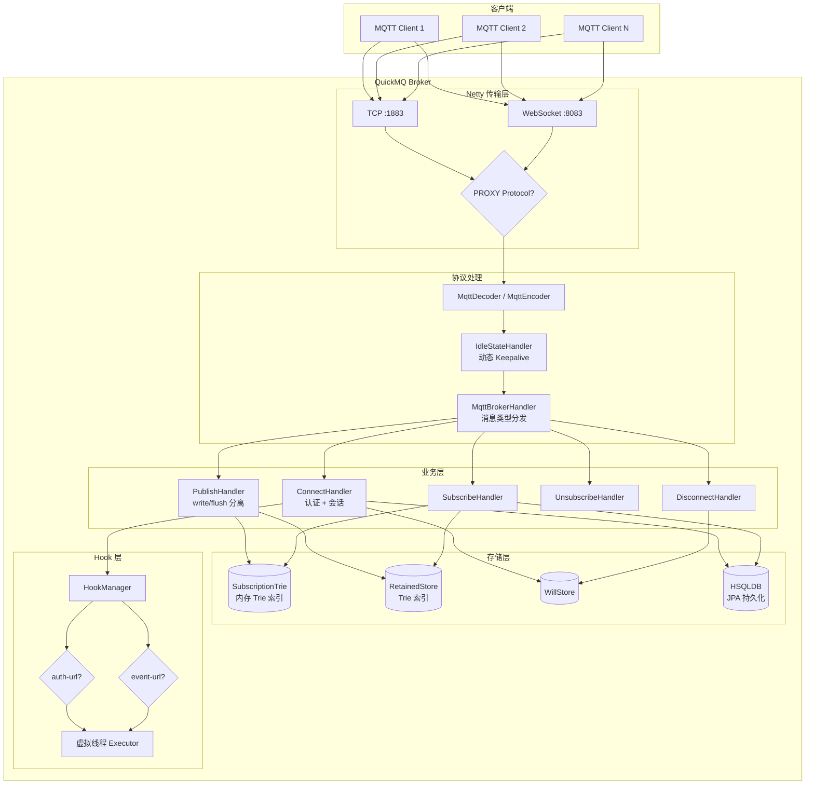
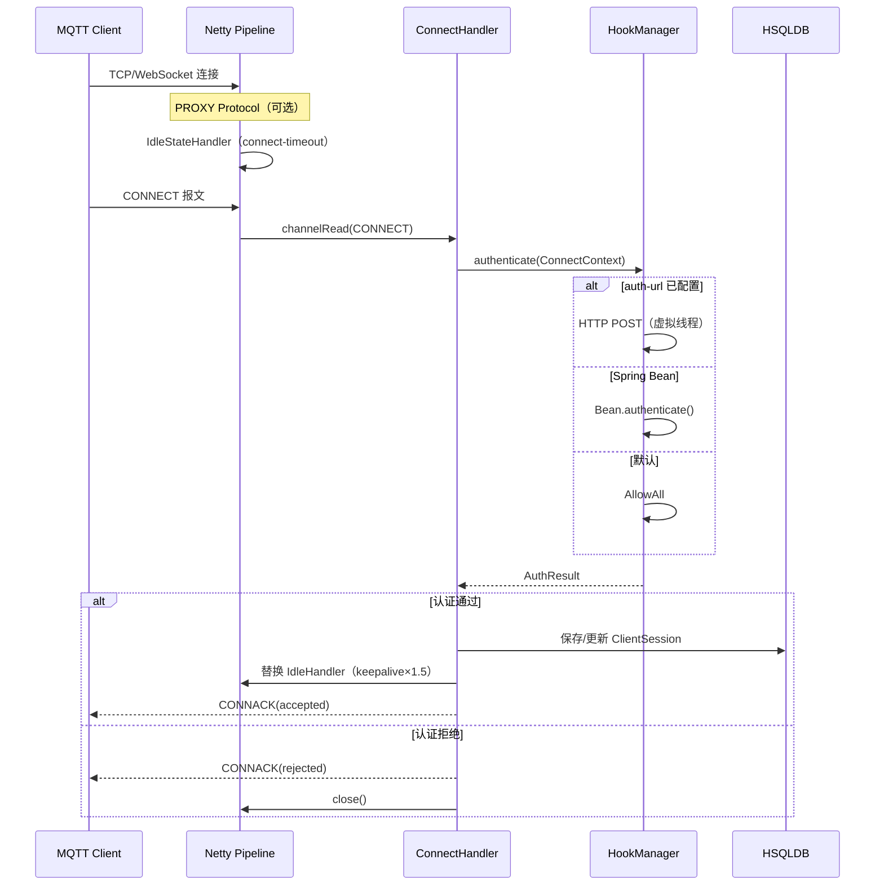
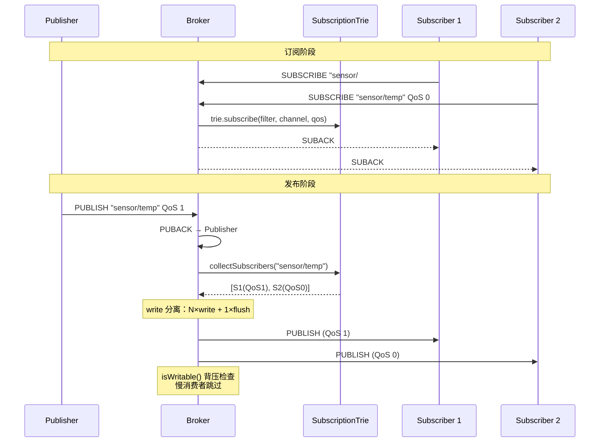

# QuickMQ

基于 **Spring Boot 3 + Netty + JPA** 的高性能 MQTT Broker，面向单机百万长连接场景设计。

---

## 特性

- **MQTT 3.1.1**：CONNECT / PUBLISH / SUBSCRIBE / UNSUBSCRIBE / DISCONNECT / PINGREQ，QoS 0/1/2，保留消息，遗嘱
- **多端口**：TCP 与 WebSocket 可同时监听多个端口
- **动态 Keepalive**：客户端 keepalive × 1.5 做空闲检测，支持服务端默认值与上限
- **HAProxy PROXY Protocol**：可选开启，透传真实客户端 IP
- **认证与审计 Hook**：HTTP Webhook（虚拟线程）或 Spring Bean，留空放行所有
- **数据持久化**：HSQLDB + JPA + QueryDSL，会话/订阅/保留消息重启不丢
- **百万连接优化**：Epoll、4KB Socket 缓冲、Recycler 对象池、Trie 订阅索引、write/flush 分离与背压
- **容器化部署**：Dockerfile 多阶段构建、docker-compose 一键启动

---

## 技术栈

| 组件 | 说明 |
|------|------|
| JDK 21 | 虚拟线程用于 Hook HTTP 调用与 JPA 阻塞 IO |
| Spring Boot 3.2 | 无 Web 容器，纯后端服务 |
| Netty 4.x | TCP + WebSocket，Linux 自动 Epoll |
| HSQLDB | 嵌入式数据库，file 模式持久化 |
| JPA + QueryDSL | 会话 / 订阅 / 保留消息持久化 |

---

## 整体架构



---

## 连接与认证流程



---

## 发布与订阅流程



---

## Hook 系统

```mermaid
graph LR
    subgraph 认证 Hook（必选）
        A1[auth-url HTTP] -->|优先| R[AuthResult]
        A2[Spring Bean] -->|次选| R
        A3[DefaultAuthHook<br/>放行所有] -->|兜底| R
    end

    subgraph 事件 Hook（可选）
        E1[event-url HTTP]
        E2[Spring Bean]
        E1 & E2 -->|合并| F[fire-and-forget]
    end

    subgraph 执行方式
        F --> VT[虚拟线程<br/>不阻塞 EventLoop]
    end
```

**认证请求/响应示例**：

```json
// 请求
{"clientId":"c1","username":"admin","password":"base64...","remoteAddress":"1.2.3.4","remotePort":54321,"protocolVersion":4,"cleanSession":true}
// 响应（放行）
{"result":"allow"}
// 响应（拒绝）
{"result":"deny","reason":"bad credentials"}
```

**事件上报示例**（8 类 `action`）：

```json
{"action":"client_connected","clientId":"c1","remoteAddress":"1.2.3.4","remotePort":54321,"timestamp":1741484400000}
{"action":"client_disconnected","clientId":"c1","remoteAddress":"1.2.3.4","remotePort":54321,"reason":"NORMAL","timestamp":1741484400000}
{"action":"message_publish","clientId":"c1","topic":"sensor/temp","qos":1,"retain":false,"payloadSize":128,"timestamp":1741484400000}
{"action":"message_delivered","clientId":"c1","topic":"sensor/temp","subscriberCount":3,"timestamp":1741484400000}
{"action":"client_subscribe","clientId":"c1","topicFilters":["sensor/#","cmd/+"],"timestamp":1741484400000}
{"action":"client_unsubscribe","clientId":"c1","topicFilters":["sensor/#"],"timestamp":1741484400000}
{"action":"connect_rejected","clientId":"c1","remoteAddress":"1.2.3.4","remotePort":54321,"reason":"bad credentials","timestamp":1741484400000}
{"action":"client_kicked","clientId":"c1","remoteAddress":"1.2.3.4","remotePort":54321,"timestamp":1741484400000}
```

---

## 数据持久化

使用嵌入式 **HSQLDB**（file 模式），通过 JPA + QueryDSL 管理：

| 表 | 实体 | 说明 |
|----|------|------|
| `client_session` | `ClientSessionEntity` | 客户端会话（cleanSession=false 时持久化） |
| `subscription` | `SubscriptionEntity` | 持久订阅关系（断线重连后恢复） |
| `retained_message` | `RetainedMessageEntity` | 保留消息（Broker 重启后仍可下发） |

数据文件位于 `./data/quickmq.*`，可通过 `spring.datasource.url` 切换为纯内存模式：

```yaml
# 纯内存（重启丢数据）
url: jdbc:hsqldb:mem:quickmq
# 文件持久化（默认）
url: jdbc:hsqldb:file:./data/quickmq;shutdown=true
```

---

## 关于虚拟线程

| 组件 | 线程模型 | 原因 |
|------|----------|------|
| Netty EventLoop | **平台线程** | 非阻塞事件驱动，虚拟线程反而增加调度开销 |
| Hook HTTP 调用 | **虚拟线程** | 阻塞 IO（HTTP 请求），虚拟线程避免占用平台线程 |
| JPA 数据库操作 | **虚拟线程**（通过 HikariCP） | JDBC 是阻塞 API，适合虚拟线程 |

---

## 快速开始

### 环境要求

- JDK 21+
- Maven 3.6+（或使用 Docker）

### 方式一：本地运行

```bash
mvn clean package -DskipTests
java -jar target/quickmq-0.0.1.jar
```

### 方式二：Docker

```bash
docker build -t quickmq .
docker run -d --name quickmq -p 1883:1883 -p 8083:8083 -v quickmq-data:/app/data quickmq
```

### 方式三：Docker Compose

```bash
docker compose up -d
```

### 方式四：生产脚本

```bash
# 应用内核参数（需 root）
sudo cp deploy/sysctl-tuning.conf /etc/sysctl.d/99-quickmq.conf
sudo sysctl -p /etc/sysctl.d/99-quickmq.conf
sudo cp deploy/limits.conf /etc/security/limits.d/99-quickmq.conf

# 启动（含 ZGC、堆 4G、DirectMemory 12G 等调优）
./deploy/start.sh
```

---

## 配置说明

主配置 `application.yml`，运行时可用 `--spring.config.location` 或环境变量覆盖。

| 配置项 | 说明 | 默认值 |
|--------|------|--------|
| `mqtt.tcp-ports` | TCP 端口列表，空则 [1883] | `[1883]` |
| `mqtt.ws-ports` | WebSocket 端口列表，空则不启 | `[8083]` |
| `mqtt.ws-path` | WebSocket 路径 | `/mqtt` |
| `mqtt.max-message-size` | 单条报文最大字节 | `262144` |
| `mqtt.default-keepalive-seconds` | keepalive=0 时默认值 | `60` |
| `mqtt.max-keepalive-seconds` | 最大 keepalive，0=不限 | `0` |
| `mqtt.connect-timeout-seconds` | 等待 CONNECT 超时 | `10` |
| `mqtt.hooks.auth-url` | 认证 URL，留空=放行所有 | `""` |
| `mqtt.hooks.event-url` | 事件 URL，留空=不上报 | `""` |
| `mqtt.hooks.http-timeout-ms` | HTTP 超时 | `5000` |
| `mqtt.proxy-protocol` | PROXY protocol 开关 | `false` |
| `spring.datasource.url` | HSQLDB 连接串 | `jdbc:hsqldb:file:./data/quickmq` |

---

## 项目结构

```
QuickMQ/
├── src/main/java/io/quickmq/
│   ├── config/              # MqttProperties, HookProperties
│   ├── data/
│   │   ├── entity/          # JPA 实体（Session, Subscription, RetainedMessage）
│   │   └── repository/      # JPA Repository
│   ├── mqtt/
│   │   ├── codec/           # WebSocket 编解码, PROXY protocol
│   │   ├── handler/         # MQTT 报文处理器
│   │   ├── hook/            # 认证与事件钩子（含 HTTP 实现）
│   │   │   └── http/        # HttpAuthHook, HttpEventHook
│   │   ├── store/           # RetainedStore, WillStore
│   │   ├── subscription/    # Trie 索引, SubscriptionStore, Recycler 池
│   │   ├── MqttServer.java
│   │   └── MqttBrokerHandler.java
│   └── QuickMQApplication.java
├── src/main/resources/
│   └── application.yml
├── deploy/
│   ├── sysctl-tuning.conf   # Linux 内核参数
│   ├── limits.conf           # ulimit 配置
│   └── start.sh              # JVM 启动脚本
├── Dockerfile                # 多阶段构建
├── docker-compose.yml
└── pom.xml
```

---

## 百万连接部署清单

| 项目 | 推荐值 | 说明 |
|------|--------|------|
| `fs.file-max` | 2000000 | 系统级 fd 上限 |
| `nofile` (ulimit) | 1500000 | 进程级 fd 上限 |
| `tcp_rmem` / `tcp_wmem` | 4096 4096 8192 | 每连接 socket 缓冲压至最小 |
| `somaxconn` | 65535 | 全连接队列 |
| JVM 堆 | 4-8 GB | 大部分内存在 DirectMemory |
| DirectMemory | 12 GB | Netty ByteBuf 池 |
| GC | ZGC | 亚毫秒停顿 |

---

## 许可证

本项目采用 MIT 许可证。
